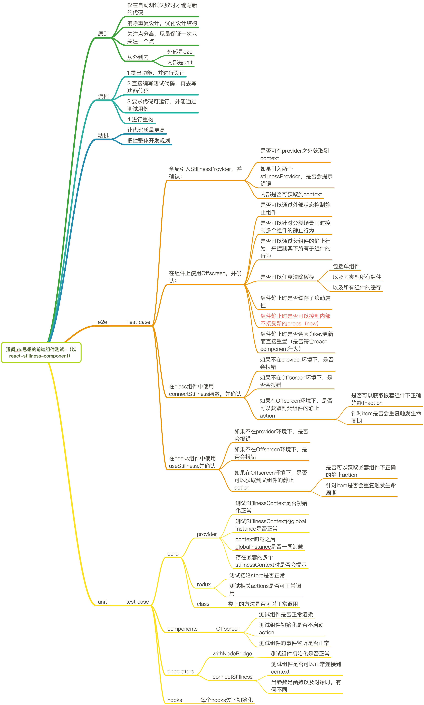

> Test-Driven Development (hereinafter referred to as **TDD**) is a design methodology in which unit test cases are written before the functional code is developed, and tests are used to drive the entire development process.

This article describes in detail how to learn **TDD** in the process of creating the `react-stillness-component` component to complete the functional development and testing. For more details on how the component is implemented, see the previous article "How to implement keep-alive in react".

## I. Preface - automation testing related

This article is written from the point of view of quality and functionality assurance in writing `react` components, which may require some prior knowledge of automation testing due to the terminology involved;

The focus of this article is mainly on how to design and why to use the tdd way to do component testing, any questions, but also welcome to discuss with the author 😁

## II. I think the actual implementation process of tdd

First, a brief review of tdd:


The actual behavior corresponding to this might be ([from wiki](https://en.wikipedia.org/wiki/Test-driven_development))

1. add a test case
2. run the test case and get a failed result (because no functionality has been implemented yet)
3. write the simplest code that just passes
4. re-run the test case and get a successful result
5. refactoring as needed, and ensure that each refactoring can pass the previous test cases
6. repeat this step, until the completion of the entire development

Of course, in the actual development process, the author also made some modifications to the reality of the situation, first look at the process after the transformation:


Here is mainly for the front-end component scenario added some more important steps

- Identify the user scenario, under what circumstances to consider using this component? This includes scenarios involving general users and professional users. Need to consider the scenario involving UI framework
- Confirm the user behavior, that is, what is the specific operation of the user? You can start from your own perspective, and then conduct actual research to observe how similar components are used
- Confirm the user environment, which includes the modern browser environment and the framework itself in the development environment.

In each completed test case before writing the first is to confirm the link to ensure that the function does not deviate from the original intention; after each test, and then verify, and the means of verification can be BDD (will be mentioned later) can also be combined with the reality of online examples to consider, if you can solve the actual problem, then prove that the function has been completed.

Of course, as the author's own daily habit is to first list the plan 😂, this time is no exception:



As you can see the bottom part is the test case planning related to TDD, there will be additional cases in the actual writing process, so the second part is the e2e simulation test is the scope of use of the box, the first phase as long as it does not exceed.

The following look at the actual case

## III. Actual cases

> The test framework used in this paper is **[jest](https://jestjs.io/)**, the relevant configuration can refer to the first point of the summary of issues

### provider

First of all, starting from the outermost layer, the component makes extensive use of `context`, so it is necessary to provide a global `provider`, because the `value` of `provider` comes from `createStillnessManager()`, so our first example is to determine whether `provider` will work properly when this method is provided

```js
it('Verify that the StillnessManager is correct', () => {
  let capturedManager;
  let manager = createStillnessManager(); // let mockManager: any = jest.fn();

  render(
    <StillnessContext.Provider value={{ stillnessManager: manager }}>
      <StillnessContext.Consumer>
        {({ stillnessManager }) => {
          capturedManager = stillnessManager;
          return null;
        }}
      </StillnessContext.Consumer>
    </StillnessContext.Provider>
  );

  expect(capturedManager).toBe(manager);
});
```

The difference between the two is that the `mock` approach filters out the interference from the `provider` when writing the code.

So we can now start the `run test`, and of course, since the code is already written, we can get a successful example with either real or mocked arguments.

And at the beginning, when the code is not written, you can follow the process and write the real code.

`provider` will have other functions besides initialization, of course, such as:

- automatically clear the global cache object when unloading
- prevent multiple provider nesting errors, the need to actively alert the user

And for these two points, we can continue to write test cases

```js
it('stores StillnessManager in global context and cleans up on unmount', () => {
  let capturedManager;

  const { container, unmount } = render(
    <StillnessProvider>
      <StillnessContext.Consumer>
        {({ stillnessManager }) => {
          capturedManager = stillnessManager;
          return null;
        }}
      </StillnessContext.Consumer>
    </StillnessProvider>
  );

  const globalInstance = () => (global as any)[INSTANCE_SYM] as any;

  expect(globalInstance().stillnessManager).toEqual(capturedManager);
  unmount();
  expect(globalInstance()).toEqual(null);
});
```

As you can see, the effect of simulating unloading is achieved by calling the returned method.

### class Component

Let's look at the core of the library, `<OffscreeenComponent>`, the props of the original component are much more complex compared to the component wrapped in `HOC`

- uniqueId: UniqueId;
- parentId: UniqueId;
- parentIsStillness: boolean;
- isStillness: boolean;
- stillnessManager: StillnessManager;

The test cases also revolve around these points, as an example:

```js
it('Does it prompt an error message when there is no context?', () => {
  global.console.error = jest.fn();

  expect(() => {
    render(
      <OffscreenComponent
        visible={true}
        isStillness={false}
        uniqueId="test1"
        parentId={rootId}
        parentIsStillness={false}
      >
        <div />
      </OffscreenComponent>
    );
  }).toThrow(/stillnessManager is required/i);
});
```

component is no way to run in the absence of `context`, then we just exclude this parameter when writing the example, if the component catches the exception and throws it, it means that the function is ok, this is a relatively simple example

to see a more complex:

```js
it('When the passed isStillness changes, clear the corresponding dom element or reload the original one', async () => {
  const Demo = ({ isStillness }: any) => {
    return (
      <OffscreenComponent
        visible={true}
        isStillness={isStillness}
        uniqueId="test1"
        stillnessManager={mockStillnessManager()}
        parentId={rootId}
        parentIsStillness={false}
      >
        <div data-testid="content" />
      </OffscreenComponent>
    );
  };

  const { queryByTestId, rerender } = render(<Demo isStillness={false} />);

  rerender(<Demo isStillness={true} />);
  expect(queryByTestId('content')).not.toBeInTheDocument();

  rerender(<Demo isStillness={false} />);
  expect(queryByTestId('content')).toBeInTheDocument();
});
```

The `isStillness` property of the component is relatively important, but also used to control the conditions of the component is still or not, here through the real simulation of `render`, and by modifying the method of passing the reference, to directly simulate the effect, if passed `true`, the component should be rendered in the `body`, that is, to find the `id` for the `content` element must be able to find, and vice versa, can not find.

In this way, we can test the `class Component`.

For more examples, see [Offscreen.spec.tsx](https://github.com/leomYili/react-stillness-component/blob/main/packages/react-stillness/src/components/__tests__/Offscreen.spec.tsx)

### HOC

How is the `HOC` tested? Take the `<Offscreen>` component as an example:

Its `props` are:

- visible:boolean, controls whether the component is static or not
- type: string or number, identifies the type of the component, repeatable, the same type of static behavior will remain the same
- scrollRest: boolean type, controls whether the component caches the scroll position when it is stationary

But these `props` are actually processed and passed to the `<OffscreenComponent>` component,

For the `HOC` itself, it just needs to ensure that it catches exceptions when the `context` is not found:

```js
it('throw an error if rendered', () => {
  console.error = jest.fn();

  class TestClass extends React.Component<
    React.PropsWithChildren<OffscreenInnerProps>
  > {}

  const DecoratedClass = withNodeBridge(TestClass);

  expect(() => {
    render(<DecoratedClass visible />);
  }).toThrow(/Expected stillness component context/);
});
```

As for the above `props`, since it involves other modules, it belongs to the scope of `BDD` testing, which will be introduced in the next BDD testing related article

### hooks

For `hooks` related, you need to use [@testing-library/react-hooks](https://github.com/testing-library/react-hooks-testing-library) This library can directly run hooks and assert the results

As an example:

Now there is a hooks `useOptionalFactory` that returns the latest results based on dependencies

The code is :

```js
function useOptionalFactory<T>(
  arg: FactoryOrInstance<T>,
  deps?: unknown[]
): T {
  const memoDeps = [...(deps || [])];
  if (deps == null && typeof arg !== 'function') {
    memoDeps.push(arg);
  }
  return useMemo<T>(() => {
    return typeof arg === 'function' ? (arg as () => T)() : (arg as T);
  }, memoDeps);
}
```

The code for the test case is :

```js
import { renderHook, act } from '@testing-library/react-hooks';

const useTest = () => {
  const [count, setCount] = React.useState(0);

  const addCount = () => {
    setCount(count + 1);
  };

  const optionFactoryFn = useOptionalFactory(
    () => ({
      collect: () => {
        return {};
      },
    }),
    [count]
  );

  return { addCount, optionFactoryFn };
};

describe('useOptionalFactory', () => {
  let hook;
  it('Depending on the variation of the dependency value, different results are generated', () => {
    act(() => {
      hook = renderHook(() => useTest());
    });

    let memoValue = hook.result.current.optionFactoryFn;

    act(() => {
      hook.result.current.addCount();
    });

    expect(memoValue).not.toStrictEqual(hook.result.current.optionFactoryFn);
  });
});
```

By using `renderHooks()` and `act()`, you can simply test, and when the test dependencies change, the return value will follow the change.

## IV. Summary of questions

1. How to set up the test environment?

    The overall architecture is `lerna+Typescript+React+rollup+Jest`, in fact, the community also has a lot of examples, here only to introduce the problems encountered in the process of building,

    - How to build a separate test environment for sub-packages?
      lerna's architecture, a good separation of the environment of each package, you can use different test frameworks in each sub-package, individually configured, for example:
      
      can be configured differently in each package
    - Test code also want to use `Typescript`?

      ```js
      // jest-transformer.js
      const babelJest = require('babel-jest');

      module.exports = babelJest.createTransformer({
        presets: [
          [
            '@babel/preset-env',
            {
              targets: {
                node: 'current',
                esmodules: true,
              },
              bugfixes: true,
              loose: true,
            },
          ],
          '@babel/preset-typescript',
        ],
        plugins: [
          ['@babel/plugin-proposal-class-properties', { loose: true }],
          '@babel/plugin-transform-react-jsx',
          ['@babel/plugin-proposal-private-methods', { loose: true }],
          [
            '@babel/plugin-proposal-private-property-in-object',
            { loose: true },
          ],
          '@babel/plugin-proposal-object-rest-spread',
          '@babel/plugin-transform-runtime',
        ],
      });

      //jest.config.js
      module.exports = {
        setupFilesAfterEnv: ['./jest-setup.ts'],
        testMatch: ["**/__tests__/**/?(*.)(spec|test).[jt]s?(x)"],
        // testRegex: 'decorateHandler.spec.tsx',
        transform: {
          "\\.[jt]sx?$": "./jest-transformer.js",
        },
        collectCoverageFrom: [
          '**/src/**/*.tsx',
          '**/src/**/*.ts',
          '!**/__tests__/**',
          '!**/dist/**',
        ],
        globals: {
          __DEV__: true,
        },
      };
      ```

      Just add the transform configuration

2. How do I test the actual rendering?

    You can use [`@testing-library/jest-dom`](https://github.com/testing-library/jest-dom), which provides related `jest` matchers on the `DOM` state, which can be used to check the tree, text, style, etc. of elements, which are also introduced in this article. Some of them, such as:

    - toBeInTheDocument: to determine the existence of elements in the document
    - toHaveClass: to determine whether the given element in its class attribute has the corresponding class name
    - toBeVisible: determine whether the given element is visible to the user

3. What if I want to test a particular example individually?

    ```js
    //jest.config.js
    module.exports = {
      setupFilesAfterEnv: ['./jest-setup.ts'],
      //testMatch: ["**/__tests__/**/?(*.)(spec|test).[jt]s?(x)"],
      testRegex: 'decorateHandler.spec.tsx',
      transform: {
        "\\.[jt]sx?$": "./jest-transformer.js",
      },
      collectCoverageFrom: [
        '**/src/**/*.tsx',
        '**/src/**/*.ts',
        '!**/__tests__/**',
        '!**/dist/**',
      ],
      globals: {
        __DEV__: true,
      },
    };
    ```

    可You can simply modify the configuration file, use `testRegex` for a file to test, of course, here the author only listed their own think more simple method, if there is a more simple method, welcome to propose 👏👏

## V. Summary

This article summarizes how to think and organize the test code in the process of writing a `react` component, of course, in the actual production development stage, there is a certain amount of testing time is the most valuable, but also `TDD` test can be implemented on the basis of, if the `TDD` test to ensure the basic functionality, then `BDD` test is to expand the use of scenarios;

According to the proportion of the code, the author himself believes that `TDD` accounts for 70%, while `BDD` is the remaining 30%;

This is a cost-effective consideration, after all, in daily work, the requirements are changed very frequently, which means that the component may encounter a variety of different scenarios, and most of the `TDD` test cases can still be retained, but the `BDD` test is not necessarily.

This is the "front-end how to do component testing" of the first, if there are any questions, welcome to discuss.
