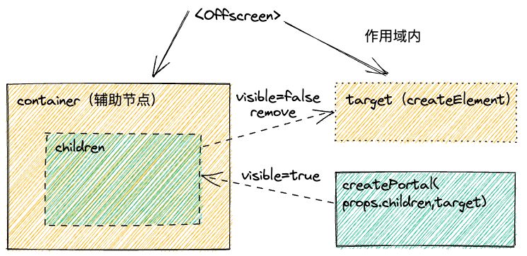
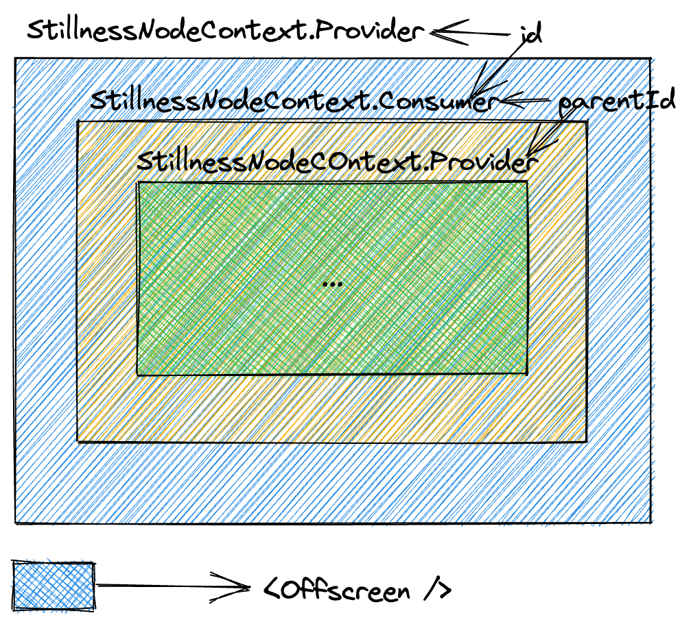
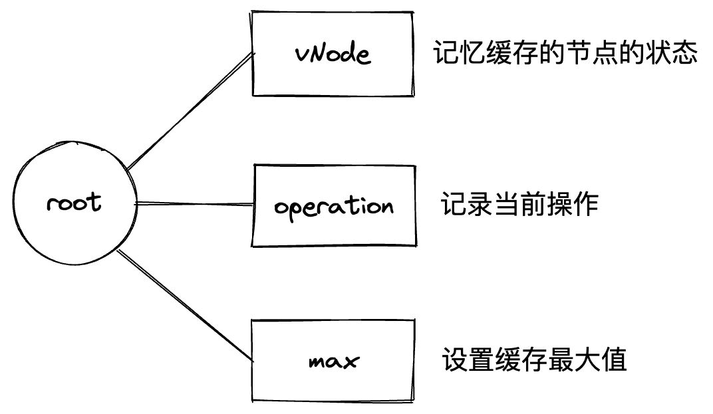
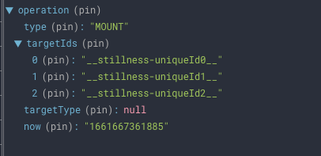
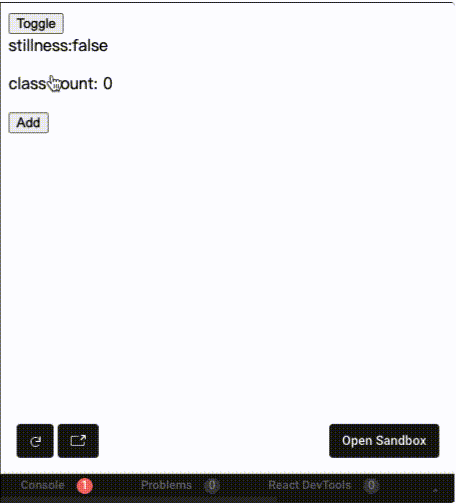
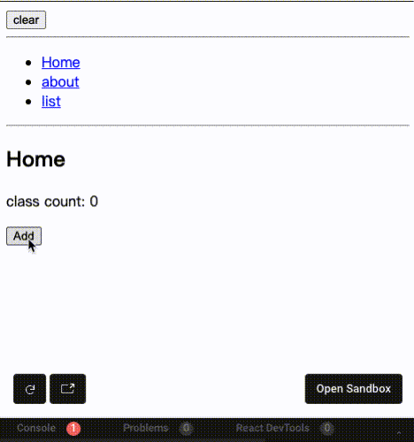
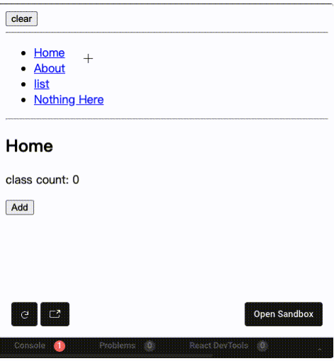

> 项目相关地址: [react-stillness-component](https://leomyili.github.io/react-stillness-component/),目前测试率已达到 90%,欢迎大家试用
>
> 官方历史相关讨论: [地址](https://github.com/facebook/react/issues/12039)
>
> 最新 react18 官方方案讨论: [地址](https://github.com/reactwg/react-18/discussions/19)

本文详细描述了如何构思并实现一个具有全局状态缓存的组件 `react-stillness-component`.

## 一.前言-现有类似组件分析

作者正常需要额外编写通用组件的场景都是遇到了特殊的问题, 且现有组件无法实现或者成本会非常高的情况下才会考虑去重新开发新的组件.

而面对组件缓存的这个场景来说,社区目前好的选择应该会是 [React Activation](https://github.com/CJY0208/react-activation/blob/master/README_CN.md), ,将组件实际渲染在外部隐藏组件层级中,在组件真实渲染时再通过 `DOM` 的操作将其移入对应组件的对应容器中,这样就可以如下的语法来控制组件的缓存:

```jsx
import KeepAlive from 'react-activation'

// keepAlive中的组件实际上是提前渲染到了外部的Keeper中
// 之后在keepAlive开始渲染时,再通过Keeper中存储的数据,将对应的dom节点移动到这里即可
...

function App() {
  const [show, setShow] = useState(true)

  return (
    <div>
      <button onClick={() => setShow(show => !show)}>Toggle</button>
      {show && (
        <KeepAlive>
          <Counter />
        </KeepAlive>
      )}
    </div>
  )
}

...

```

在 react18 之前已经算是比较不错的方法了, 不过对于我们的场景来说还是会有几个问题:

1. 老项目代码十分庞大,上述的实现方法会带来对依赖生命周期顺序的功能造成影响,比如 ref 的取值等,虽然可以通过 setTimeout 的方式来延时获取,但一个是成本略大,另一个需要改变之前的写法,项目中随处可见的 setTimeout 也会影响代码的阅读以及代码 review
2. context 实际上也是如此,但相比上面的情况要好很多,只需要切换成 `react-activation`提供的 createContext 即可
3. 合成事件冒泡会失效,这也是最终未采用上述方案的根本原因,作者所在的团队会有多维表等复杂组件,针对拖拽悬浮定位都会有一定的要求,缓存相比只能算是体验优化,不能影响主要功能.
4. 在手动缓存时需要给每个`<KeepAlive>`组件增加`name`,也会增加一定的成本.

而如果是针对新项目来说,这个库实际上已经可以达到生产环境的级别了.

## 二.理想效果

这里的理想效果是作者最终想要达到的目标.

1. 首先,`keepalive`的效果只能算是锦上添花,它不能影响项目中其他功能的开发,所以类似 context,事件冒泡,动画之类都不能受到影响.
2. 同时,上手成本不能太高,api 要足够简单,类似手动增加唯一标识并进行管理的方式成本就有点高了,最好可以不用声明唯一标识,但也能进行手动卸载.
3. 性能优先,懒加载,真实移除 DOM 节点.
4. 需要记忆组件级别的滚动效果.
5. 解决嵌套组件中的缓存效果不一致,如果仅仅使用一个 state 去控制是否缓存,则嵌套中的`keep-alive`组件就没办法实时更新了.
6. 统一的数据通信机制以及局部更新

也因此,针对上述目标,作者最终选用了 [`Portals`](https://zh-hans.reactjs.org/docs/portals.html)以及 redux(用来管理缓存状态)来解决这些问题

## 三.实现原理

先来看一段伪代码

```jsx
import { Offscreen,useStillness } from 'react-stillness-component';

...
function App() {
  const [show, setShow] = useState(true)

  return (
    <div>
      <button onClick={() => setShow(show => !show)}>Toggle</button>
      <Offscreen visible={show}>
        <Count />
      </Offscreen>
    </div>
  );
}

...
function Count() {
  const collected = useStillness({
    collect: (contract) => ({
      stillnessId: contract.getStillnessId(),
      unset: contract.unset,
      clear: contract.clear,
    }),
  });

  return (
    <div>
      ....
    </div>
  );
}
...
```

相比目前社区中利用`didMount`,`unMount`的能力,这里简化为一个 prop,同时提供相关 hooks,来支持手动控制缓存.

核心就是:

```jsx
<Offscreen visible={show}>
  <Count />
</Offscreen>
```

会不会有很熟悉的感觉,如果把`Offscreen`换成`div`, `visible`换成`visibility:visible|hidden`,那么就只是一段显隐的逻辑就可以完成缓存的实际效果了 😬

当然这里确实没有这么简单,否则也不用单独开发组件了,但这确实是作者希望的组件使用方式.



转换为代码:

```jsx
...

targetElement = document.createElement('div');

// didMount
containerRef.current.insertAdjacentElement(
  'afterend',
  targetElement
);

ReactDOM.createPortal(props.children, targetElement)

...
```

然后就是对于核心的扩展了,需要解决嵌套下 `<keepAlive>` 相关组件行为的一致性以及整体的缓存控制.

## 四.功能设计

出于对性能的考量,redux 中存储的只是缓存节点的数据映射,在每一个缓存节点被真实载入之后,都会同步建立一个对应的数据节点,有了第一步的数据之后,下面就是建立层级结构即可,得益于 react tree 以及 context,可以很轻易的推导出每个节点与其他节点之间的关系.



每一层只要拿到最近一层的 `StillnessNodeContext` 中的 id,就可以建立嵌套组件关系的映射,

所以工作的重点如下:

- 缓存节点数据状态设计
- 节点之间的状态同步
- 性能优化,懒加载

### 1. 状态数据结构设计



这里的 vNode 表现为:

```js
interface vNodeState {
  uniqueId: UniqueId; // 唯一标识
  type?: UniqueId; // 类型
  parentId: UniqueId; // 父节点标识
  visible?: boolean; // props中的显隐属性
  isStillness?: boolean; // 计算之后真实的静止状态
}
```

operation 可能不太好理解,这里主要用来标记一些可能会影响全局中节点的行为,比如:

- unset: 重置静止节点的历史状态
- clear: 重置所有静止节点的历史状态
- mount: 有节点触发了静止状态
- unmount: 有节点脱离了静止状态

当上述任何一个事件触发时,都需要根据起始节点产生依赖影响更改,有的时候甚至需要将所有缓存节点都更新一遍.

max 则提供了自动控制缓存的方法,当用户声明最大缓存节点数量时,组件会根据规则(第一层`<Offscreen>`节点才会算作是一个节点,其子节点全部跟随父节点)并利用 `lru` 算法自动清除或加入缓存之中.

### 2. 状态同步

这里的同步主要指的就是父节点触发了静止操作之后,需要实时通知到其下的所有子节点.得益于数据结构的设计,当一个节点触发了静止或者解除了静止操作之后,都可以根据 `uniqueId` 以及 `parentId` 计算出所有需要变更状态的节点



### 3. 性能优化

性能优化主要体现在两个方面

- 局部更新:利用了 redux,以及状态数据结构设计,每次更新节点状态只会影响相关联的节点
- 懒加载:实际上 `<Offscreen>` 节点上的 `visible` 属性是可以进行优化的,如果一开始`visible`属性就为`false`,则`children` 是不需要直接加载的

```jsx
useIsomorphicLayoutEffect(() => {
  if (isMountRef.current) {
    const parentIsStillness = globalMonitor.isStillness(stillnessParentId);
    uniqueNodeRegistration.update({
      ...props,
      parentId: stillnessParentId,
      isStillness: parentIsStillness || !props.visible,
    });

    // 获取到真实静止状态
    const thisIsStillness = globalMonitor.isStillness(
      uniqueNodeRegistration.getUniqueId()
    );

    ...

    if (!thisIsStillness) {
      setIsCurrentlyMounted(true);
    }
  }
}, [props, stillnessParentId]);

useEffect(() => {
  if (isCurrentlyMounted === false) {
    if (isMountRef.current) {
      setIsCurrentlyMounted(true);
    } else {
      isMountRef.current = true;
    }
  }
}, [isCurrentlyMounted]);

const RenderedWrappedComponent = useMemo(
  () => <Decorated {...wrapperProps} />,
  [wrapperProps]
);

return isCurrentlyMounted ? RenderedWrappedComponent : null;
```

这里只需要注意有可能父节点已经是静止状态了,所以子节点即使`visible`为`true`,但也是需要懒加载的.

### 4. 滚动状态记忆

因为节点经过 DOM 操作之后会重置滚动位置,所以我们需要把 `<Offscreen>`下的第一层 dom 节点的滚动状态记录下来,在解除静止状态时再进行设值即可还原

```jsx
listenerTargetElementChildScroll = () => {
  if (this.props?.scrollReset) {
    this.targetElement.addEventListener(
      'scroll',
      throttle(
        (e: any) => {
          if (isRealChildNode(this.targetElement, e.target)) {
            let index = this.cacheNodes.findIndex((el) => {
              return el.node === e.target;
            });

            if (index !== -1) {
              this.cacheNodes[index] = {
                node: e.target,
                left: e.target.scrollLeft || 0,
                top: e.target.scrollTop || 0,
              };
            } else {
              this.cacheNodes.push({
                node: e.target,
                left: e.target.scrollLeft || 0,
                top: e.target.scrollTop || 0,
              });
            }
          }
        },
        this,
        120
      ),
      true
    );
  }
};
```

这里因为涉及到父子嵌套组件,所以作者采用了事件监听的方法,在每个 `<Offscreen>` 节点下产生滚动事件时,对其下的滚动元素进行记忆,并保存在该节点的作用域中.

### 5. HOC

解决了最重要的问题之后,后面就是提供各种快捷的使用方法了,该组件支持`HOC`和`Hooks`的用法,

`HOC` 只需要提供一个`spec`即可:

```jsx
import { connectStillness } from 'react-stillness-component';

...

const spec = {
  mounted: (props, contract) => {
    return 'mounted';
  },
  unmounted: (props, contract) => {
    return 'unmounted';
  },
  collect: (props, contract) => {
    return {
      isStillness: contract.isStillness(),
      stillnessId: contract.getStillnessId(),
    };
  }
};

export const WithCount = connectStillness(spec)(CountComponent);
...
```

`spec` 参数[可以参考](https://leomyili.github.io/react-stillness-component/zh-CN/docs/api/Decorators/connectStillness)

`spec`中`collect`函数返回的值就是组件新的`props`;

### 6. Hook

`Hooks`方面主要有两个`hook`来帮助用户更好的完成缓存节点的控制

- useStillnessManager:偏底层一些,将内部的方法也做了一定的归纳,并提供给用户进行自定义
- useStillness:与`connectStillness`效果一致

```jsx
import { useStillness, useStillnessManager } from 'react-stillness-component';

function Count(props) {
  const stillnessManager = useStillnessManager();
  // stillnessManager.getStore();

  const [count, setCount] = useState(0);
  const collected = useStillness({
    mounted: (contract) => {
      return 'mounted';
    },
    unmounted: (contract) => {
      return 'unmounted';
    },
    collect: (contract) => {
      return {
        isStillness: contract.isStillness(),
        stillnessId: contract.getStillnessId(),
        item: contract.getStillnessItem(),
      };
    },
  });

  useEffect(() => {
    console.log(collected);
  }, [collected]);

  return <div>...</div>;
}
```

以上就是整体的架构设计.有兴趣的小伙伴可以看下源码,结构借鉴了`react-dnd`的想法,也算是重新阅读了一遍它的数据状态与 UI 分离是如何设计的.

之后会给大家演示一遍 `react-stillness-component` 的实际应用.

## 五.实战演练

以下提供的例子仅仅是作者根据自身情况从而编写的例子,实际上组件本身的功能非常简单,并没有很明显的兼容问题,如果有结合其他库无法达到效果的情况,也欢迎联系作者.

### 1. 首先是简单 demo



可以通过[在线 demo](https://codesandbox.io/s/02-example-react-379q3k?from-embed)查看具体效果.

### 2. 然后就是最常见的 `react-router` ,这里分为 v5 版本和 v6 版本



`react-router-v5`中最主要的还是自定义了`<Switch>`组件,从而达到了路由缓存的效果,更多详细介绍,[可以参考](https://leomyili.github.io/react-stillness-component/zh-CN/docs/examples/react-router/v5),并自行调试



`react-router-v6`版本就简单了很多,只需要定制outlet,就可以达到缓存的效果,源码[可以参考](https://codesandbox.io/s/04-example-react-routerv6-uuv2xc?from-embed),并自行调试

### 3. 然后是在 `umi v3` 框架中的应用,这也是作者目前所在团队的基础框架

首先需要安装已封装好的插件 `yarn add umi-plugin-stillness react-stillness-component`;

其次在`.umirc.ts`中进行使用:

```js
import { defineConfig } from 'umi';

export default defineConfig({
  nodeModulesTransform: {
    type: 'none',
  },
  routes: [
    {
      exact: false,
      path: '/',
      component: '@/layouts/index',
      routes: [
        {
          exact: false,
          path: '/home',
          component: '@/pages/home',
          stillness: true,
          routes: [
            {
              path: '/home/a',
              component: '@/pages/a',
              stillness: true,
            },
          ],
        },
        { path: '/about', component: '@/pages/about', stillness: true },
        { path: '/list', component: '@/pages/list' },
      ],
    },
  ],
  stillness: {},
});
```

需要做缓存处理的节点增加`stillness:true`即可

效果:


其中最重要的还是自定义`<Switch>`组件,使用 `modifyRendererPath` 能力,重新定义新的 `renderer`,再使用与`react-route-v5`类似的修改方法,就可以达到效果了.坏处是需要及时同步与更新,比如新的`react18`的相关能力,作者就还没有更新上去.

[在线地址](https://codesandbox.io/s/05-example-umi-v3-plugin-puubqt?from-embed=&file=/src/pages/list.tsx),可自行调试

### 4. 以及作者自己较为感兴趣的 `next.js` 框架

nextjs相对特殊,文件路由系统无法通过外部修改,因此,自定义了_app.js,通过增加 StillnessSwitch组件,简单的将其下的路由组件变成了可静止的组件.

```jsx
import React, { useState, useEffect } from 'react';
import { useRouter } from 'next/router';
import { Offscreen } from 'react-stillness-component';

function matchPath(pathname, routes) {
  const result = routes.find(({ path }) => path === pathname) || null;

  return result;
}

const StillnessSwitch = (props) => {
  const { Component, pageProps } = props;
  const router = useRouter();
  const [stillnessRoutes, setStillnessRoutes] = useState([]);
  const [route, setRoute] = useState([]);

  useEffect(() => {
    if (pageProps.stillness) {
      !matchPath(router.pathname, stillnessRoutes) &&
        setStillnessRoutes([
          ...stillnessRoutes,
          { Page: Component, _props: pageProps, path: router.pathname },
        ]);
      setRoute([]);
    } else {
      setRoute([
        {
          Page: Component,
          _props: pageProps,
          path: router.pathname,
        },
      ]);
    }
  }, [Component, router.pathname]);

  return (
    <>
      {stillnessRoutes.concat(route).map(({ Page, _props, path }) => {
        if (_props.stillness) {
          return (
            <Offscreen
              key={path}
              type={path}
              visible={path === router.pathname}
            >
              <Page {..._props} />
            </Offscreen>
          );
        }

        return <Page {..._props} />;
      })}
    </>
  );
};

export default StillnessSwitch;
```


[在线地址](https://codesandbox.io/s/06-example-nextjs-kwcu20?from-embed=&file=/pages/index.js),可自行调试

## 总结

本文详细介绍了在react中如何实现`keep-alive`的效果,并详细描述了具体思路,作者一开始其实是希望介绍组件的自动化测试相关,后面实际场景中遇到了这个需求,那索性就先把组件实现,之后再用实际的组件来完成前端测试.这是 《前端如何做组件测试》的前置篇,如果有任何问题,欢迎讨论.